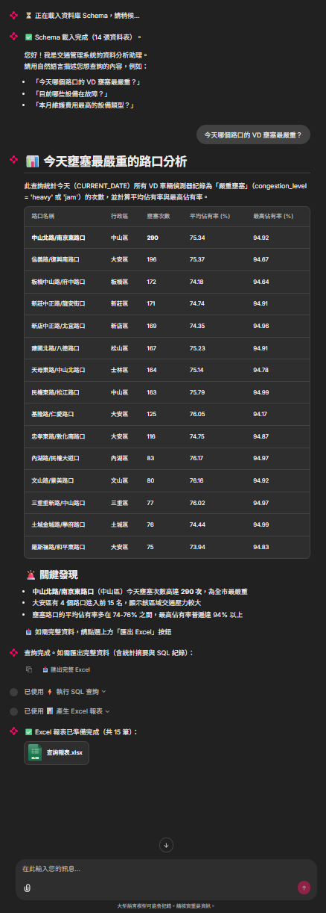

# ChatReport — Chat-to-SQL for Traffic Management



A proof-of-concept that lets operators ask natural-language questions about traffic data and get instant answers, with one-click Excel export.

支援兩種資料庫後端，透過 `.env` 的 `DB_TYPE` 切換：

```
【PostgreSQL 模式】                    【Vertica 模式】
docker compose                         直接以 Python 執行

Chainlit UI (8000)                     Chainlit UI (8000)
    │ HTTP                                 │ HTTP
Agent / Claude Tool Use                Agent / Claude Tool Use
    │ MCP over SSE                         │ MCP over SSE
MCP Server (8080)                      MCP Server (8080)
    │ psycopg2                             │ vertica-python
PostgreSQL (Docker)                    Vertica（雲端，外部連線）
```

---

## 快速啟動 (Vertica)

> Vertica 是雲端資料庫，不需要 Docker，直接以 Python 啟動兩個程序即可。

### 前置需求

| 工具 | 最低版本 |
|------|---------|
| Python | 3.10+ |

### 1. 安裝依賴

```bash
pip install -r mcp_server/requirements.txt
pip install -r app/requirements.txt
```

### 2. 設定環境變數

```bash
cp .env.example .env
```

編輯 `.env`，填入 Vertica 連線資訊與 Anthropic API Key：

```env
ANTHROPIC_API_KEY=sk-ant-...

DB_TYPE=vertica
DB_HOST=your-vertica-host
DB_PORT=5433
DB_NAME=your_db
DB_USER=your_user
DB_PASSWORD=your_password
DB_SCHEMA=your_schema
DB_CONNECTION_TIMEOUT=15
DB_SSL_MODE=disable        # 若 Vertica 有啟用 SSL 改為 require
```

載入環境變數（擇一）：

```bash
# Linux / macOS
export $(grep -v '^#' .env | xargs)

# Windows PowerShell
Get-Content .env | Where-Object { $_ -notmatch '^#' -and $_ -ne '' } | ForEach-Object { $k,$v = $_ -split '=',2; [System.Environment]::SetEnvironmentVariable($k,$v) }
```

### 3. 啟動 MCP Server

開一個終端機視窗：

```bash
cd mcp_server
python server.py
```

看到以下訊息代表連線成功：

```
[VerticaClient] 已連線至 <host>:<port>/<db> schema=<schema>
Uvicorn running on http://0.0.0.0:8080
```

### 4. 啟動 Chainlit App

另開一個終端機視窗：

```bash
cd app
chainlit run chainlit_app.py --port 8000
```

### 5. 開啟聊天介面

[http://localhost:8000](http://localhost:8000)

試著問：

> 目前哪些設備在故障？

> 上週哪 5 個路口流量最高？

> 本月維護費用最高的設備類型是哪一種？

---

## 完整快速啟動 (PostgreSQL)

> PostgreSQL 在本機 Docker container 內，需要 Docker Desktop。

### 前置需求

| 工具 | 最低版本 |
|------|---------|
| Docker Desktop | 24+ |
| Python（host，用於 seed） | 3.10+ |

```bash
pip install psycopg2-binary
```

### 1. 設定環境變數

```bash
cp .env.example .env
```

編輯 `.env`：

```env
ANTHROPIC_API_KEY=sk-ant-...
DB_TYPE=postgres
DB_PASSWORD=changeme          # 正式環境請更換
CHAINLIT_AUTH_SECRET=...      # 任意 32 字元隨機字串
```

### 2. 啟動所有服務

```bash
docker compose up --build
```

三個 container 依序啟動：`postgres` → `mcp_server` → `app`。  
等到看見 `Chainlit running on http://0.0.0.0:8000` 即可。

### 3. Seed 測試資料

另開終端機（container 需在運行中）：

```bash
# 小資料集 — ~26,000 筆，約 10 秒（預設）
python database/seed_data.py

# 中 — ~200,000 筆
python database/seed_data.py --scale medium

# 大 — ~1,000,000 筆
python database/seed_data.py --scale large
```

若 `DB_PASSWORD` 有更改：

```bash
python database/seed_data.py --password <your_password>
```

### 4. 開啟聊天介面

[http://localhost:8000](http://localhost:8000)

試著問：

> 昨天中山區所有路口的平均車流量是多少？

> 列出本週發生過事故且尚未處理的路口

> 最近 24 小時有哪些 CMS 顯示板正在顯示警告訊息？

查詢完成後，點擊 **Export Excel** 按鈕下載格式化報表。

---

## Service Endpoints

| Service | URL | Notes |
|---------|-----|-------|
| Chat UI | http://localhost:8000 | Chainlit |
| MCP Server (SSE) | http://localhost:8080 | FastAPI |
| PostgreSQL | localhost:5432 | DB: `traffic_db`, User: `traffic_user`（僅 postgres 模式） |

---

## Seeding Options（PostgreSQL 模式）

```
python database/seed_data.py [OPTIONS]

Options:
  --scale   small | medium | large     Row count preset (default: small)
  --host    HOST                        Postgres host (default: localhost)
  --port    PORT                        Postgres port (default: 5432)
  --dbname  DBNAME                      Database name (default: traffic_db)
  --user    USER                        DB user (default: traffic_user)
  --password PASSWORD                   DB password (default: changeme)
```

| Scale | Rows (approx.) | Seed time |
|-------|---------------|-----------|
| small | 26,000 | ~10 s |
| medium | 200,000 | ~60 s |
| large | 1,000,000 | ~5 min |

---

## Reset & Re-seed（PostgreSQL 模式）

```bash
docker compose down -v
docker compose up -d postgres
# 等待約 10 秒健康檢查通過
python database/seed_data.py
```

---

## Excel Export

每次匯出產生含三個工作表的 `.xlsx`：

| Sheet | Content |
|-------|---------|
| **Raw Data** | 完整查詢結果，凍結表頭，自動欄寬 |
| **Statistics** | 每個數值欄位的 COUNT / SUM / AVG / MAX / MIN |
| **Audit Log** | SQL、時間戳記、筆數、最後 3 輪對話紀錄 |

條件格式：`jam` → 紅、`critical` → 橙、`fault` → 黃、未解決事件 → 粗體。

---

## Project Structure

```
ChatReport/
├── app/
│   ├── chainlit_app.py          # Chainlit entry point
│   ├── agent.py                 # Claude Tool Use loop (ReAct)
│   ├── schema_context.yaml      # Business vocabulary → SQL mapping（唯一需要修改的檔案）
│   └── skills/
│       ├── schema_discovery.py  # Session 啟動時探索 live schema
│       ├── clarification_checker.py
│       └── excel_exporter.py    # openpyxl 三頁式報表
├── mcp_server/
│   ├── server.py                # FastAPI / SSE MCP server
│   ├── db_client.py             # PostgresClient / VerticaClient 雙驅動抽象層
│   └── hooks/
│       └── pre_query.py         # SELECT-only guard, table whitelist, LIMIT injection
├── database/
│   ├── schema.sql               # Three-tier inheritance schema（PostgreSQL）
│   └── seed_data.py             # 台北路口模擬資料產生器
├── tests/
│   ├── unit/                    # pre_query hook, clarification checker
│   └── integration/             # DB edge-cases, live query scenarios
├── docker-compose.yml           # postgres + mcp_server + app（PostgreSQL 模式）
└── .env.example
```

---

## Running Tests

```bash
pip install -r tests/requirements-test.txt
pytest
```

Integration tests 需要 PostgreSQL running（`docker compose up -d postgres`）。

---

## Adapting to Another Domain

只需修改 [`app/schema_context.yaml`](app/schema_context.yaml)，將業務詞彙對應到你的資料表與欄位名稱即可，不需改動任何程式碼。

---

## Security Notes

- MCP Server 強制 **SELECT-only**；`INSERT`、`UPDATE`、`DELETE`、DDL 及 `pg_sleep`/`dblink` 均被攔截。
- 所有查詢自動加上 `LIMIT 10000` 與 30 秒 timeout（PostgreSQL；Vertica 依連線設定）。
- `ANTHROPIC_API_KEY` 與 `DB_PASSWORD` 不會被 log。
